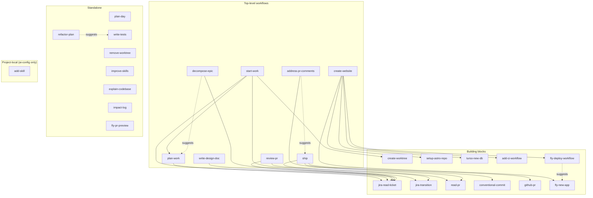

# AI Config

Personal tooling for AI-assisted development workflows. Portable across macOS and Linux.

## Setup

Clone the repo wherever you keep your code and run the setup script — it self-locates, so the clone path doesn't matter:

```bash
git clone <remote-url> ai-config
cd ai-config && ./setup
```

The setup script is **idempotent** — safe to run again after pulling updates. It:
- Makes skill scripts executable
- Symlinks each skill in `skills/` into `~/.agents/skills/` and `~/.claude/skills/`
- Symlinks `zed/tasks.json` to `~/.config/zed/tasks.json`
- Symlinks `AGENTS.md` to `~/.config/zed/AGENTS.md` and `~/.claude/CLAUDE.md`

---

## AI Skills

Reusable agent skills in `skills/<name>/SKILL.md`, available as slash commands in Claude Code.

| Skill | Description |
|---|---|
| `start-work` | Read a Jira ticket, create a worktree (if needed), produce a coding plan, and move the ticket to In Progress |
| `create-worktree` | Create a git worktree with a `lane/TICKET-description` branch |
| `remove-worktree` | Remove a git worktree and clean up its directories |
| `ship` | Full ship workflow: validate branch, stage, commit, push, open a GitHub PR, and transition the Jira ticket |
| `read-pr` | Resolve a GitHub PR (link, number, or current branch) and fetch its details, diff, and review threads (building block) |
| `review-pr` | Review a GitHub PR from a link or number, using the linked Jira ticket and PR body for context |
| `address-pr-comments` | Fix open review threads in code and produce a checklist summary |
| `write-design-doc` | Author a technical design doc / RFC from a problem statement or ticket, grounded in the codebase |
| `decompose-epic` | Break a large initiative into sequenced, independently-shippable tickets and milestones |
| `plan-work` | Produce a concrete, file-level coding plan from a Jira ticket or a plain description |
| `refactor-plan` | Sequence a large refactor into small, green-to-green steps behind a test safety net |
| `explain-codebase` | Map an unfamiliar repo or subsystem: entry points, data flow, key abstractions, where to change |
| `plan-day` | Summarize GitHub notifications and open PRs into a prioritized daily work list |
| `impact-log` | Append an impact-framed accomplishment to the Anytype "Impact Log" page for perf/promo |
| `conventional-commit` | Craft a conventional commit message, get approval, then commit and push |
| `github-pr` | Open a GitHub PR for the current branch |
| `jira-read-ticket` | Fetch a Jira ticket and summarize its intent and acceptance criteria (building block) |
| `jira-transition` | Transition a Jira issue to a new status |
| `write-tests` | Generate tests for a file or function, following the project's existing testing conventions |
| `create-website` | Full new-website workflow: Astro repo, Turso db, Fly.io app, and CI/deploy/preview workflows |
| `setup-astro-repo` | Scaffold a web repo with pnpm, Astro, astro-bulma, and Drizzle + oxlint/oxfmt/vitest (building block) |
| `turso-new-db` | Create a Turso database, asking for a new or existing database group (building block) |
| `fly-new-app` | Create a Fly.io app for the current project without deploying (building block) |
| `add-ci-workflow` | GitHub Actions CI workflow: build, lint, test, fmt with pnpm (building block) |
| `fly-deploy-workflow` | GitHub Actions workflow: db:migrate + deploy to Fly.io on merge to main (building block) |
| `fly-pr-preview` | GitHub Actions workflow: temporary per-PR Fly.io preview apps with a forked Turso db |
| `improve-skills` | Review recent skill usage and suggest improvements to SKILL.md files |

### How the skills relate

Several skills are **building blocks** that larger workflow skills compose. `start-work` and `ship` are the two top-level entry points; `plan-work`, `review-pr`, and `address-pr-comments` reuse the same shared pieces.



Standalone skills — `plan-day`, `remove-worktree`, `write-tests`, `improve-skills`, `explain-codebase`, `refactor-plan`, `impact-log`, and `fly-pr-preview` — don't compose other skills and aren't composed by them.

### Project-local skills

Project-local skills live in `.agents/skills/` (AI-agnostic source of truth). The whole folder is symlinked as `.claude/skills` → `../.agents/skills`, so anything added under `.agents/skills/` shows up in Claude Code automatically. They only load when working inside this repo — `setup` does **not** link them globally. Currently:

- `add-skill` — scaffold a new skill in `skills/`, update the README table and diagram, then run `setup`.

---

## Agent Instructions

`AGENTS.md` at the repo root contains style and workflow instructions for AI agents. It is symlinked to:

- `~/.config/zed/AGENTS.md` — loaded by Zed
- `~/.claude/CLAUDE.md` — loaded by Claude Code as user-level instructions
